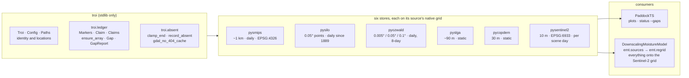
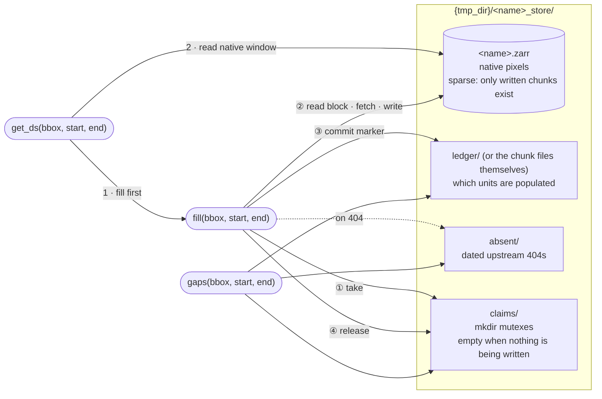
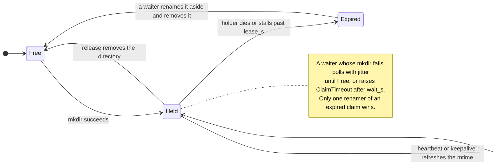
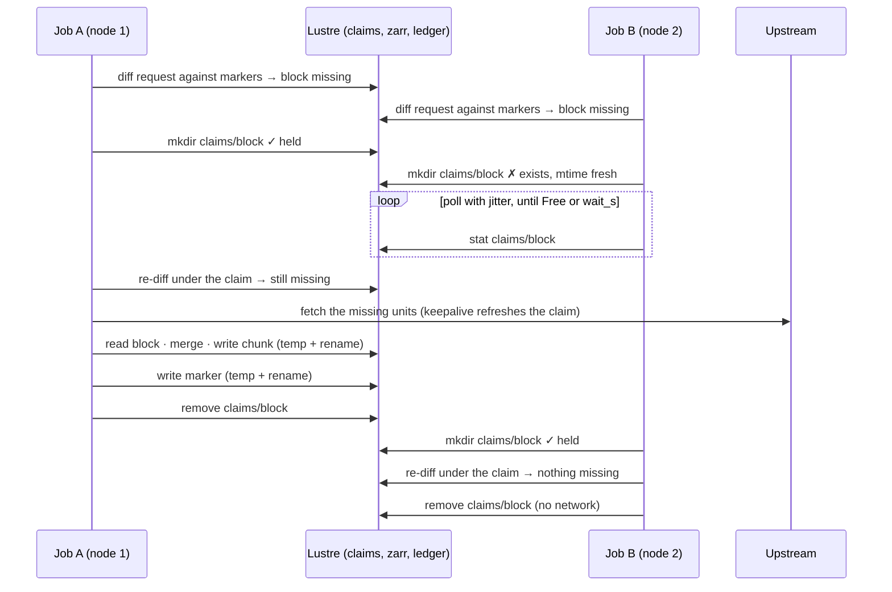
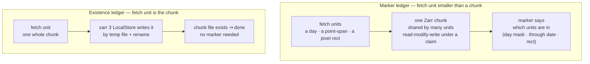
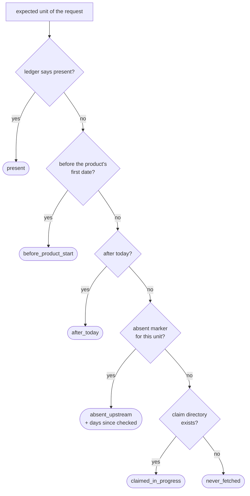

# The filesystem ledger

Why every store on the `gadi` branch keeps its ledger as files, what the
pieces are, and the protocol they all follow. This is the canonical
description; each store's README shows the same structure with its own
units, keys and directory names.

## The ecosystem at a glance



- **troi** owns identity (`Troi`), configuration (`Config`) and the ledger
  primitives. It carries no geospatial dependency.
- **A store** owns one machine-wide Zarr store on its source's own lattice,
  a ledger of what is populated, `fill` that fetches only what is missing,
  `get_ds` that returns native pixels with georeferencing attrs, and `gaps`
  that audits completeness. A store never resamples.
- **A consumer** reads stores. Only the downscaling model needs every source
  on one grid, and it does that regridding itself from the attrs.

## Why not a database

The stores run as many PBS jobs on many Gadi nodes against one store on
Lustre. Gadi mounts `/g/data` and `/scratch` with `localflock`: POSIX file
locks are only visible within one node. SQLite relies on those locks in every
journal mode, so two jobs on different nodes sharing an `index.db` can corrupt
it. No persistent database server can run on Gadi either: login nodes kill
daemons and compute jobs end at walltime.

What Lustre's metadata server does serialise across nodes is `mkdir`,
`rename`/`replace` and `link`. `troi.ledger` is built from those alone.

## Anatomy of a store

Every store directory has the same four kinds of thing, and the three
entry points touch them in the same way.



| Piece | What it holds | Who writes it | Who reads it |
|---|---|---|---|
| `<name>.zarr` | Native pixels, one sparse array per variable or product. Only chunks that were written exist on disk. | `fill` | `get_ds` |
| `ledger/` | One small JSON marker per populated unit. For stores whose unit is a whole chunk, the chunk file itself is the ledger and there is no `ledger/`. | `fill`, after the pixels | `fill` (to diff), `gaps` |
| `absent/` | One dated JSON per upstream 404. A fact about upstream at a moment, never a reason to skip a fetch. | `fill` | `gaps` only |
| `claims/` | One directory per unit currently being written. Empty when the store is idle. | `fill` | `fill` (mutex), `gaps` (to report `claimed_in_progress`) |

## Primitives (`troi.ledger`)

**`Markers(root)`** — one JSON file per written unit, at
`root/<p1>/.../<leaf>.json`. Written to a temporary name and moved into place
with `os.replace`, so a reader sees either nothing or a complete file. Last
writer wins, which is fine because every writer of a unit writes the same
fact. Shard directories so none holds more than a few thousand entries.

**`Claim(root, key, lease_s=600, wait_s=3600)`** — a cross-node mutex:
`mkdir root/claims/<key>` succeeds for exactly one process. Others poll with
jitter. The claim carries a lease, which is what makes a crashed job's claim
recoverable:



A holder that will work longer than the lease wraps that work in
`with claim.keepalive():`, which runs `heartbeat()` on a daemon thread. A
holder whose work is always far shorter than the lease needs no heartbeat.
`Claims(root, keys)` acquires several claims in sorted order, so two jobs
wanting overlapping sets cannot deadlock, and has the same `keepalive()`.

**`ensure_array(root, group, name, **kw)`** — creates a zarr array exactly
once across processes, under a claim on `('meta', name)`, so cold-start jobs
never race on `zarr.json`.

**`Gap` / `GapReport`** — the vocabulary of every store's `gaps()` audit.
Statuses: `never_fetched`, `absent_upstream`, `before_product_start`,
`after_today`, `claimed_in_progress`. A report is complete when nothing is
`never_fetched` or `claimed_in_progress`; the rest describe the upstream
record, not this store.

## The write protocol

For a unit that shares a Zarr chunk with other units (pysmips' 64-day blocks,
pysentinel2's pixel rectangles, pysilo's 8×8-point blocks):

```
with Claim(root, block_key):      # one writer per block, across nodes
    block = read(zarr)            # what is already there
    data  = fetch(...)            # network; keepalive if long
    write(zarr, block | data)     # zarr 3 commits each chunk by rename
    markers.write(block_key, ...) # the ledger now says these units exist
```

Two jobs on two nodes asking for the same block:



The re-diff under the claim is what turns the second job's work into a
no-op. The diff before the claim is only an optimisation: a fully present
request takes no claim and touches no network.

What each failure point leaves behind:

| Crash or stall | On disk afterwards | Next fill |
|---|---|---|
| Before the chunk write | nothing new | fetches again |
| After the chunk, before the marker | pixels the ledger does not know about | refetches and rewrites them; idempotent |
| After the marker | a complete unit | no work |
| Holder stalls past the lease without heartbeat | a stale claim directory | taken over; the taker re-reads the block, so a half-applied write is redone, not merged |
| Holder dies mid-write | possibly a chunk file without its marker, plus a stale claim | as above |

Non-404 per-unit errors are held until the units that did succeed are
written and marked, then raised. A failing day never discards its block.

## Two kinds of ledger

Which ledger a store keeps follows from the size of its fetch unit relative
to a Zarr chunk.



The existence ledger needs `write_empty_chunks=True` at array creation.
Without it an all-NaN chunk (ocean) is never materialised and looks
unfetched forever.

| Store | Fetch unit | Ledger | Claim key | Lease | Heartbeat |
|---|---|---|---|---|---|
| pysmips | one COG window per (day, 128 px chunk), 8 days in flight | marker: 64-char day mask per (product, time chunk, chunk) | every (product, tc, cy, cx) of the time chunk, via `Claims` | 600 s | keepalive |
| pysilo | one DataDrill CSV per (point, missing span), 4 in flight | marker: `through` date per point per (block, year) | `('silo', by, bx)` | 900 s | keepalive |
| pyozwald | one OPeNDAP window per (variable, year, block), 4 in flight | marker: `through` date per (cadence, variable, year, block) | `(cadence, var, year, by, bx)` | 900 s | keepalive |
| pycopdem | one COG window per 1200 px chunk | existence of the chunk file | `('dem', cy, cx)` | 600 s | none, seconds of work |
| pyslga | one COG window per 1200 px chunk per layer | existence of the chunk file; `layers/<key>.json` registers a layer | `('slga', key, cy, cx)`; `('layer', key)` | 600 s | none, seconds of work |
| pysentinel2 | one bulk `odc.stac.load` per (window, batch of days), 16 threads | marker: coverage rect per (day, uuid) | `('s2', day)`, taken around the writes only | 1800 s | none, download happens outside the claim |

## Absent markers (`troi.absent`)

A 404 writes `absent/<unit>.json` with `status` and `checked_at`. That is a
fact about upstream at a moment, not a verdict. **It never suppresses a
fetch**: the next fill asks again. Only `gaps()` reads it, to report
`absent_upstream` with an age instead of `never_fetched`.

`clamp_end(end)` keeps fills from asking for the future.
`gdal_no_404_cache(url_prefix)` gives `rasterio.Env` the setting that stops
GDAL remembering a 404 for the life of the process.

## What `gaps()` reports

Every store enumerates the units a request would need, exactly as `fill`
does, and classifies each one that is not present. No network.



`report.complete` is true when nothing is `never_fetched` or
`claimed_in_progress`. After a successful fill of a published range the only
expected statuses are `absent_upstream` for days the source has not
published yet, `before_product_start` and `after_today`.

## Native georeferencing contract

Stores never resample. Every raster `get_ds` sets:

| attr | meaning |
|---|---|
| `crs` | e.g. `'EPSG:4326'` |
| `transform` | six affine numbers `(a, b, c, d, e, f)`, pixel-edge origin, north-up |
| `nodata` | the native nodata value, or `None` if NaN already |
| `native_res_m` | approximate pixel size in metres, for documentation |

Coordinates are pixel centres. Any regridding happens in the consumer that
owns the target grid, from these attrs alone. See
[conventions.md](conventions.md).
